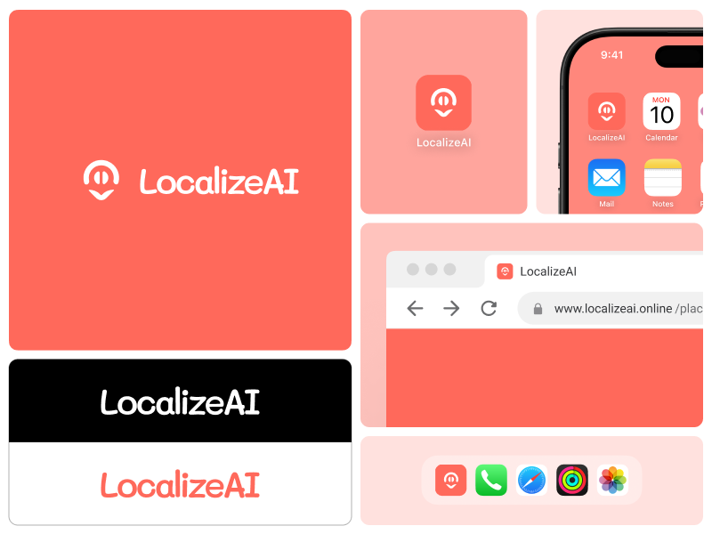
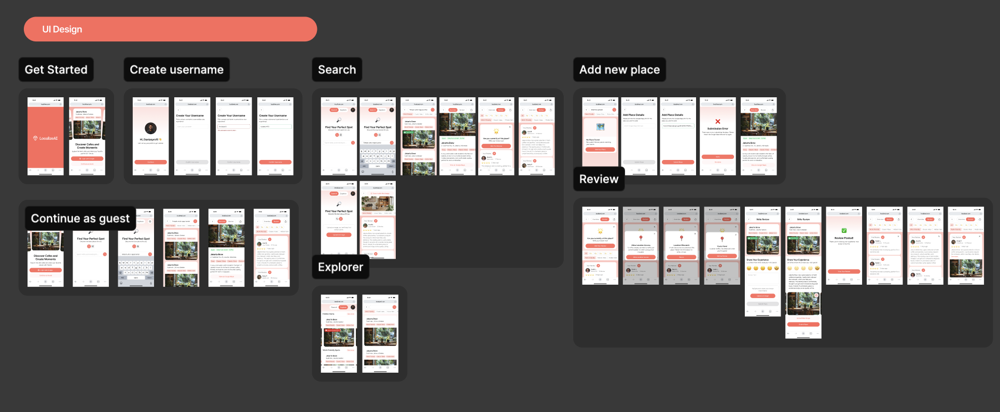
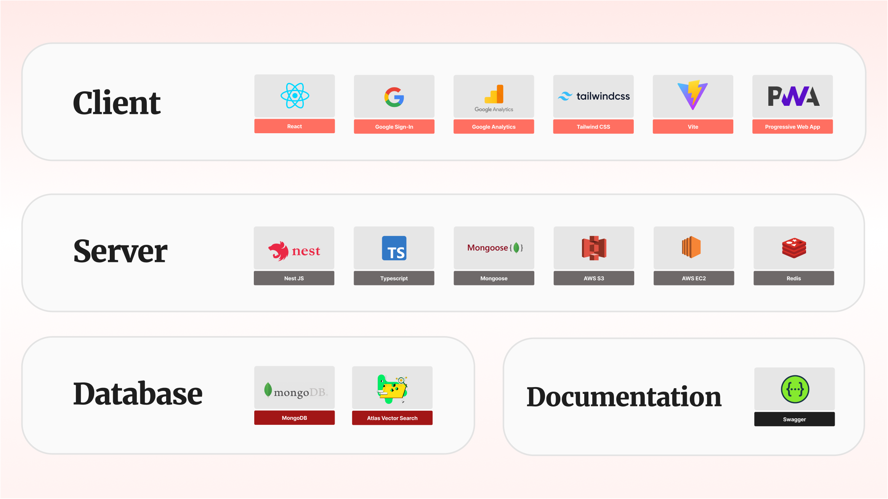
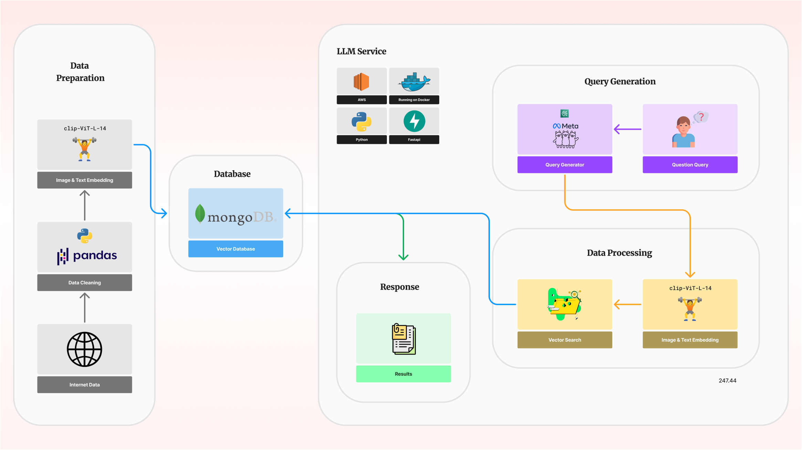
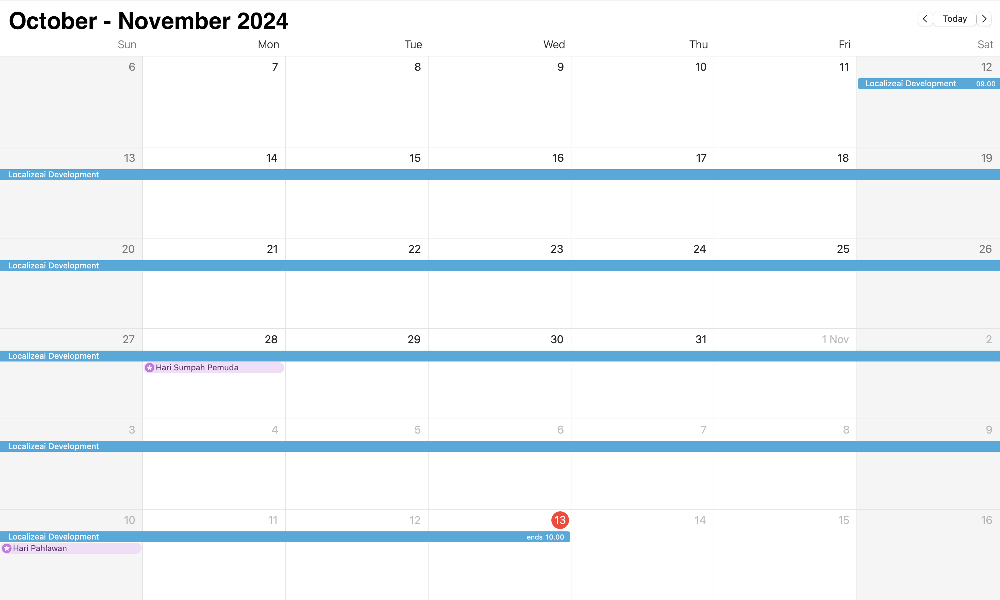

# Localizeai

Localizeai is an innovative social media platform designed to enhance culinary experiences and the discovery of dining spots in Jakarta. It empowers users to find the perfect place—whether it’s a hidden café or an iconic dining location—through seamless text and image search.

[https://localizeai.online](https://localizeai.online)

## Table of Contents
- [Table of Contents](#table-of-contents)
- [Design Thinking](#design-thinking)
  - [1. **Empathize**](#1-empathize)
  - [2. **Define**](#2-define)
  - [3. **Ideate**](#3-ideate)
  - [4. **Prototype**](#4-prototype)
  - [5. **Test**](#5-test)
- [Design System](#design-system)
- [UI UX Design](#ui-ux-design)
- [Tech Stack](#tech-stack)
- [LLM Architecture](#llm-architecture)
- [Timeline](#timeline)
- [Repository Link](#repository-link)

## Design Thinking

### 1. **Empathize**

- **Goal**: Understand the needs of café enthusiasts, food lovers, and work-from-café (WFC) individuals who seek cozy, productive, and inspiring local spaces.
- **Insights**:
  - Many users enjoy discovering cafés and eateries but face challenges in finding places that align with their preferences for ambiance, food quality, and WFC suitability.
  - Inspiration is often derived from social media platforms, but endless scrolling can be time-consuming and unproductive.
- **Research Focus**:
  - Interview users who frequently seek new cafés for work or socializing.
  - Survey potential users to identify their favorite aspects of café culture and the specific criteria they consider important (ambiance, food, Wi-Fi, seating).
  - Explore how vector search technology could simplify discovery and enhance relevance in search results.

### 2. **Define**

- **Problem Statement**: Café and food lovers in Jakarta need an intuitive way to discover the best places that match their specific preferences for working, relaxing, or socializing without the hassle of endless searching on multiple platforms.
- **Objective**: Develop a platform that offers tailored recommendations, supports community engagement, and streamlines the discovery of new cafés and eateries.
- **Key Areas**:
  - Quick, relevant search for places based on keywords and images.
  - Community-driven reviews and recommendations for authenticity.
  - A personalized experience that reflects each user’s unique taste.

### 3. **Ideate**

- **Concepts Generated**:
  - The **"Localizeai"** platform as a centralized hub for café and dining spot discovery, integrating keyword and image-based search for precision.
  - Leveraging **MongoDB’s Vector Search** to allow image-based discovery, providing users with suggestions that visually match their preferences.
  - Community-driven features, such as reviews, ratings, and the ability to contribute new location suggestions.
- **Features**:
  - Text and image search options for finding ideal spots.
  - Personalized recommendations tailored to user preferences and past searches.
  - Interactive map and community features for shared discovery.

### 4. **Prototype**

- **Tools Used**:
  - **Figma** for UI/UX design, focusing on a user-friendly and visually appealing interface.
  - **LLM**: Llama 3.2 also use langchain and embeding model with clip-ViT-L-14 and MongoDB Vector Database.
  - **MongoDB Vector Search** for precise image-based recommendations.
  - **Server**: Node.js Express & Python Fastapi, but in the end we use `TypeScript Nest.js & Python Fastapi`
  - **Client**: React.js for building a dynamic, responsive web platform and we implemented PWA.
- **Core Functionality**:
  - Seamless keyword and image-based search.
  - User profiles with saved searches, favorites, and contribution history.
  - A map view with details of cafés, including reviews and community posts.
- **Development Timeline**:
  - Prototype development over 1 months, from ideation to a functional MVP, with regular user feedback and testing phases.

### 5. **Test**

- **Testing Methods**:
  - Usability testing with café enthusiasts to gather initial impressions and optimize navigation flow.
  - Performance testing focused on MongoDB’s Vector Search for smooth image recognition and accurate recommendations.
  - Community feedback sessions to refine features like review submissions, image uploads, and location suggestions.
- **Challenges Observed**:
  - Fine-tuning the relevance of recommendations to better align with user preferences.
  - Addressing potential load times and performance issues in areas with limited internet connectivity.
- **User Feedback**:
  - Positive response to personalized suggestions and the streamlined search experience.
  - Requests for additional features, such as saving favorite searches and creating custom lists.
  - Feedback highlighted the need for detailed images and reviews to enhance decision-making.

## Design System

## UI UX Design

[Figma Link](https://www.figma.com/design/Qvgoz9S3PydLNNBcNDQbEn/LocalizeAI?node-id=2002-13&t=DsAJtxVHI4qnPMLN-1)

## Tech Stack

## LLM Architecture

- **Backend**: [FastAPI](https://fastapi.tiangolo.com/) - For building a fast, efficient RESTful API.
- **Database**: [MongoDB](https://www.mongodb.com/) - Used to store and manage vectorized data for both images and text search.
- **Embedding Model**: [CLIP-ViT-L-14](https://huggingface.co/openai/clip-vit-large-patch14) - Used for generating embeddings from text and images, making search more accurate and relevant.
- **Tokenizer**: [openai/clip-vit-large-patch14](https://huggingface.co/openai/clip-vit-large-patch14) - Tokenizes input text for compatibility with CLIP-ViT-L-14.
- **LLM Models**:
  - **Primary**: Amazon Bedrock (Llama) - Used for dynamic keyword and context understanding.
  - **Secondary**: GroqCloud (Llama) - Used as a fallback if Bedrock is unavailable.
- **Other Libraries**:
  - **LangChain** - For efficient LLM application management and language chaining.
  - **LangSmith** - Enhances observability for debugging and model performance monitoring.
  - **PyMongo** - Provides a native Python driver for MongoDB interactions.

## Timeline

## Repository Link

- LLM App: [Github Repo](https://github.com/localize-ai/llm-app)
- Web App: [Github Repo](https://github.com/localize-ai/client-app)
- Server App: [Github Repo](https://github.com/localize-ai/backend-app)